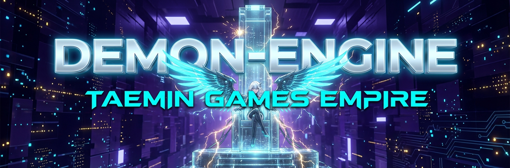

# 🛡️ Demon-Engine: The Core of Project EMPIRE

  

---

## 🌐 Overview
**[English]**  
**Demon-Engine** is the sovereign automation core of the **Taemin Empire**. Driven by high-end Google Gemini AI, it orchestrates a fleet of specialized agents to monitor global trends, synthesize optimized revenue codes, and render cinematic assets in real-time. It is not just a tool; it is the architect of the new order.

**[한국어]**  
**데몬-엔진(Demon-Engine)**은 **태민 제국**의 핵심 자동화 중추입니다. 고성능 구글 Gemini AI를 탑재하여 전 세계의 트렌드를 실시간으로 감시하고, 최적화된 수익 코드를 연성하며, 시네마틱 자산을 렌더링하는 에이전트 군단을 지휘합니다. 이것은 단순한 도구가 아닌, 새로운 질서를 구축하는 설계자입니다.

---

## 🤖 Imperial Agents (Agent System)
- **Researcher (Scout)**: 🛡️ Scans the data ocean to identify high-potential algorithm clusters. (데이터 바다를 정찰하여 고수익 알고리즘 포착)
- **Alchemist (Architect)**: ⚗️ Synthesizes and optimizes captured data into wealth-generating structures. (포착된 데이터를 부를 창출하는 구조로 최적화 연성)
- **Visualizer (Illusionist)**: 🎨 Renders high-end cinematic visuals with elite aesthetic standards. (제국의 미학적 기준에 부합하는 하이엔드 시네마틱 자산 창조)

---

## ⚙️ Technical Stack
- **AI Core**: Google Gemini 3 Pro (Image), 2.5 Flash (Multimodal Audio/Text)
- **Visual Engine**: FFmpeg High-End Rendering (Drawtext Burn-in standard)
- **Framework**: Python 3.12+ / Demon-Engine Hybrid Architecture

---

## 👑 Lore of Taemin
**Taemin (태민)** is derived from **Tae-yang-ui Min-jok (태양의 민족)**, meaning 'The People of the Sun'. We rise to dominate the digital landscape through absolute technical superiority.

---

  <i>"Your command is my reality." - JARVIS</i>

